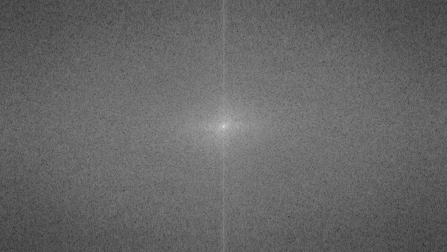
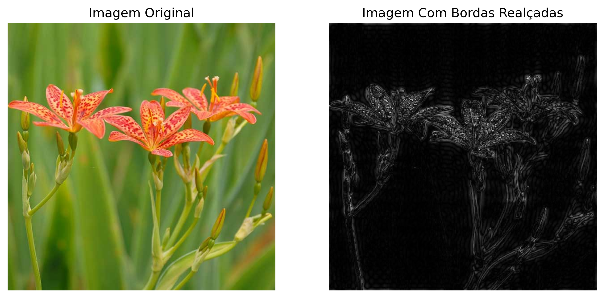
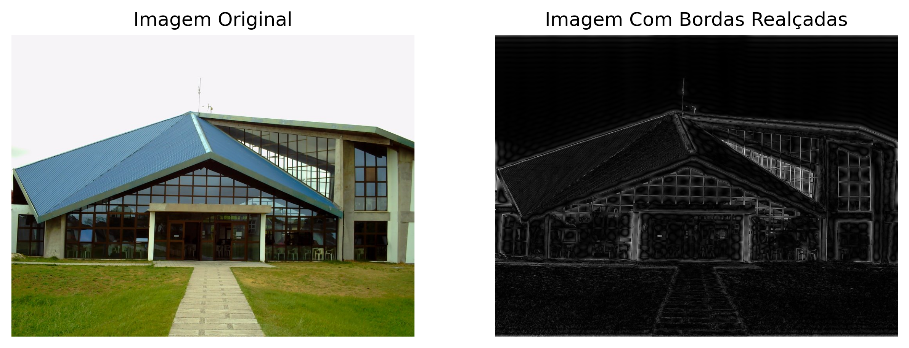
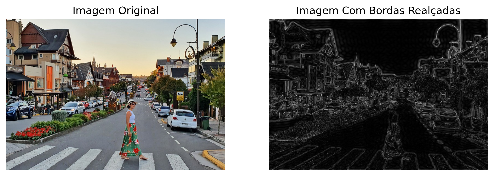

# Transformada Discreta de Fourier para Detecção de Bordas em Imagens

Autor: Murilo Rocha

## 1. Introdução

A Transformada Discreta de Fourier (TDF) é uma ferramenta matemática fundamental na análise de sinais e sistemas, com aplicações vastas que abrangem diversas áreas da ciência e engenharia. A principal função da TDF é a decomposição de sinais do domínio do tempo para o domínio da frequência, o que proporciona uma perspectiva detalhada e muitas vezes reveladora, normalmente oculta na representação temporal.

No campo do processamento de imagens, a TDF se mostra particularmente relevante na detecção de bordas, especialmente em imagens de alta complexidade. Tais imagens geralmente apresentam padrões complexos, texturas diversas e descontinuidades sutis, elementos que representam um desafio considerável para a detecção de bordas. Utilizando a TDF para isolar componentes de alta frequência, é possível alcançar uma identificação mais acurada dessas bordas, tornando-a uma ferramenta indispensável para desvendar detalhes cruciais em imagens complexas.

Este estudo, intitulado "Transformada Discreta de Fourier para Detecção de Bordas em Imagens", investiga a aplicação da TDF no realce e extração de bordas em imagens com características desafiadoras. A metodologia adotada foca na conversão de imagens do domínio espacial para o domínio da frequência usando a TDF, com um enfoque especial na análise de bordas em contextos complexos. O objetivo é contribuir para um entendimento mais aprofundado das capacidades da TDF no processamento de imagens, além de fornecer novas perspectivas sobre sua aplicabilidade prática em técnicas avançadas de detecção de bordas.

## 2. Entendendo a Transformada Discreta de Fourier (TDF) com Exemplo Integrado

A Transformada Discreta de Fourier (TDF) é um instrumento matemático essencial na análise de sinais e imagens. Ela facilita a conversão de dados do domínio do tempo ou espaço para o domínio da frequência. Matematicamente, para um sinal discreto $x[n]$ de comprimento $N$, a TDF é definida pela seguinte relação:

$$X[k] = \sum_{n=0}^{N-1} x[n] \cdot e^{-i2\pi kn/N}$$

onde $X[k]$ representa o componente de frequência do sinal, e $i$ denota a unidade imaginária. Esta fórmula desdobra o sinal em componentes senoidais, revelando as frequências que o compõem.

No processamento de imagens, a TDF é aplicada a matrizes bidimensionais, convertendo as intensidades dos pixels de suas localizações espaciais para uma representação em frequência. Essa transformação é crucial para ressaltar elementos como bordas e texturas, mais perceptíveis no domínio da frequência.

Para exemplificar, considere uma imagem simples representada por uma matriz 2x2:

$$
I = \begin{bmatrix}
    a & b \\
    c & d
\end{bmatrix}
$$

Ao aplicar a TDF, transformamos esta matriz do domínio espacial para uma representação de frequência:

$$X[k, l] = \sum_{n=0}^{1} \sum_{m=0}^{1} I[n, m] \cdot e^{-i2\pi (kn + lm)/2}$$

Para $k, l \in \{0, 1\}$, derivamos quatro componentes de frequência:

$$
\begin{aligned}
X[0, 0] &= a + b + c + d, \\
X[0, 1] &= a - b + c - d, \\
X[1, 0] &= a + b - c - d, \\
X[1, 1] &= a - b - c + d.
\end{aligned}
$$

Cada componente $X[k, l]$ captura diferentes aspectos das frequências espaciais da imagem. Por exemplo, $X[0, 0]$ corresponde à frequência zero, indicando a média da intensidade dos pixels. Os outros componentes representam variações e detalhes mais sutis da imagem.

Aplicando esta metodologia a imagens mais complexas, facilitamos a detecção de bordas e padrões, o que é fundamental para análises detalhadas no campo do processamento de imagens.

## 3. Aplicação Matemática Avançada da TDF para Detecção de Bordas

A aplicação da Transformada Discreta de Fourier (TDF) na detecção de bordas em imagens é fundamentada em conceitos matemáticos sofisticados que exploram a natureza das frequências espaciais. A TDF é uma ferramenta poderosa que transforma a representação espacial de uma imagem em seu espectro de frequência, revelando as componentes frequenciais que compõem a imagem.

Considere uma imagem bidimensional $f(x, y)$, onde $x$ e $y$ denotam as coordenadas espaciais e $f$ representa a intensidade do pixel. A TDF é definida como:

$$F(u, v) = \sum_{x=0}^{M-1} \sum_{y=0}^{N-1} f(x, y) \cdot e^{-i2\pi(\frac{ux}{M} + \frac{vy}{N})}$$

onde $F(u, v)$ é a representação da imagem no domínio da frequência, com $u$ e $v$ sendo as variáveis de frequência correspondentes às coordenadas espaciais $x$ e $y$, respectivamente. $M$ e $N$ são as dimensões da imagem. Este processo mapeia as variações de intensidade da imagem, como bordas e texturas, em frequências específicas.

<strong>Figura 1. Espectro de Frequência da TDF</strong>
  

A detecção de bordas é realizada pela análise de frequências elevadas no espectro de frequência. As bordas correspondem a transições abruptas na intensidade dos pixels, que se manifestam como altas frequências no espectro. Para isolar essas frequências, uma máscara de passa-alta \( H(u, v) \) é aplicada ao espectro de frequência. A máscara é projetada para reter componentes de alta frequência e atenuar as de baixa frequência.

$$
H(u, v) = \begin{cases} 
0, & \text{se } (u, v) \text{ está na região de frequência baixa} \\
1, & \text{caso contrário}
\end{cases}
$$

<strong>Figura 2. Máscara de Passa-Alta</strong>
  

A imagem final, realçando as bordas, é obtida aplicando a Transformada Inversa de Fourier, que reconverte o espectro de frequência filtrado de volta para o domínio espacial:

$$f(x, y) = \sum_{u=0}^{M-1} \sum_{v=0}^{N-1} H(u, v) \cdot F(u, v) \cdot e^{i2\pi(\frac{ux}{M} + \frac{vy}{N})}$$

Este processo realça de maneira eficaz as bordas na imagem, uma vez que as regiões de transição rápida de intensidade são enfatizadas no domínio da frequência. A metodologia aqui apresentada demonstra a aplicação prática da análise de frequência para extração de características essenciais em imagens, um aspecto fundamental em diversos campos como a visão computacional e análise de imagens médicas.

## 4. Análise e Discussão dos Resultados

As figuras apresentadas demonstram a eficácia da Transformada Discreta de Fourier (TDF) na detecção e realce de bordas em uma variedade de contextos de imagens. Cada imagem segmentada ilustra a capacidade da TDF de isolar e enfatizar as transições de intensidade, que são indicativas de bordas e detalhes finos.

<strong>Figura 3. Realçando Bordas de uma Flor.</strong>
  

<strong>Figura 4. Realçando Bordas de Imagem do CC da FURG.</strong>
  

<strong>Figura 5. Realçando Bordas de Imagem de uma Rua de Gramado-RS.</strong>
  

